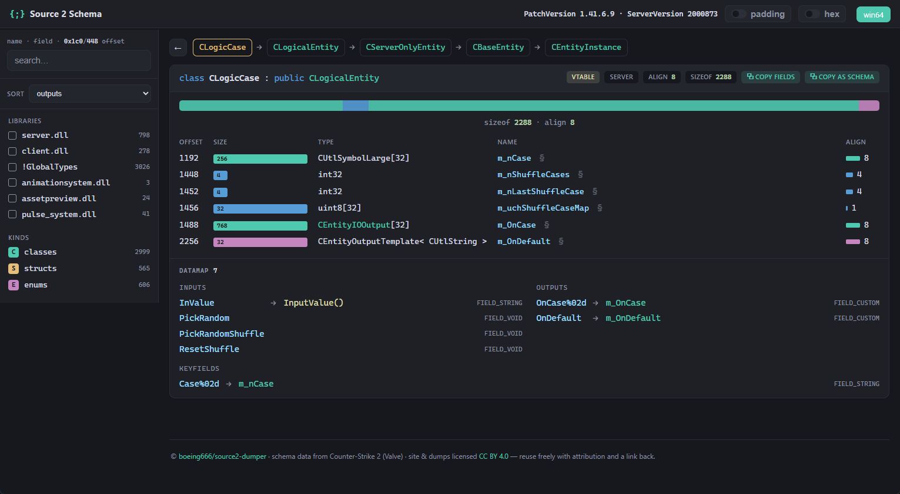

# source2_dumper

**Live site: [boeing666.github.io/source2-dumper](https://boeing666.github.io/source2-dumper/)**

Offline schema dumper for Source 2 (CS2), for **Windows (`.dll`) and Linux (`.so`)**
binaries. Loads the game binaries **without running the game**, pulls every registered
class/enum from `SchemaSystem`, and emits a single browsable reference page — every type
as C++-like code, with offsets, sizes, datamap, inheritance and cross-references.
Auto-updates each game patch via GitHub Actions.

## Example output



Per class: fields with `offset / size / align` (toggle hex or dec), the `m_pDataMap`
(inputs / outputs / keyfields → members), full inheritance chain, referenced-by, and
copy-as-schema. Filter by library, Ctrl-F any type, deep-link any field.

## Build

```
git clone --recursive --depth 1 https://github.com/Wend4r/sourcesdk thirdparty/sourcesdk
git clone --recursive --depth 1 https://github.com/Wend4r/cpp-dynlibutils thirdparty/cpp-dynlibutils

cmake -B build -G Ninja -DCMAKE_BUILD_TYPE=Release
cmake --build build
```

## Run

Fetch CS2 binaries (anonymous Steam, no account needed) then dump:

```
bash scripts/download-depots.sh     # or scripts\download-depots.ps1 on Windows
build/source2_dumper sdk            # -> sdk/<platform>.html
```

CI ([`schema-site.yml`](.github/workflows/schema-site.yml)) does this on a Windows and
a Linux runner each game update and publishes the merged page to GitHub Pages.

## License

- **Source code** (dumper, generator, scripts) — [MIT](LICENSE).
- **Generated dumps & the website** (per-class pages, index, layout) — [CC BY 4.0](https://creativecommons.org/licenses/by/4.0/): reuse freely, but **credit `boeing666/source2-dumper` and link back** to this repo.

The underlying schema facts belong to Counter-Strike 2 / Valve; this project claims no rights over them.
